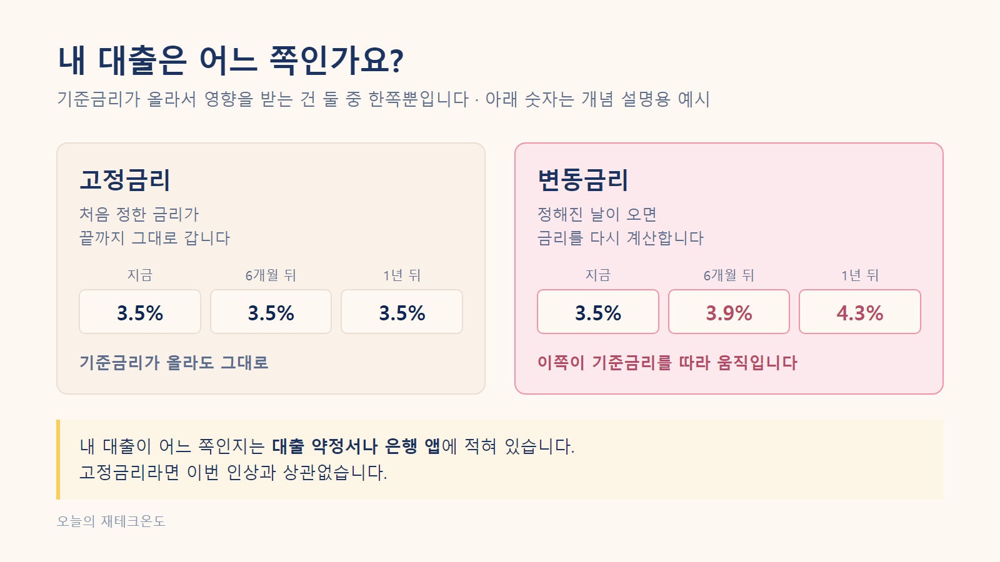
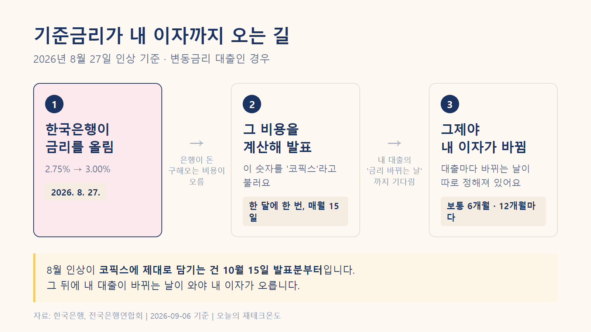
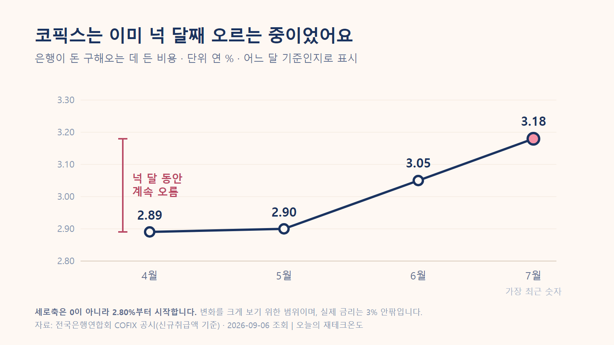
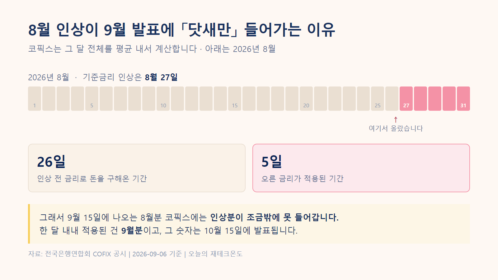
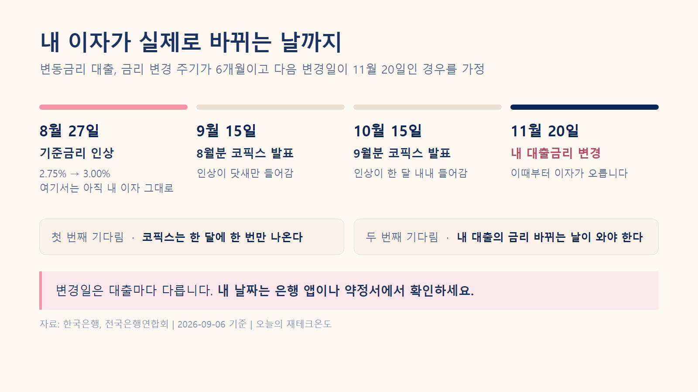

<!-- 이 파일은 md2html.js가 draft.md에서 자동으로 만듭니다. 직접 고치지 마세요. -->
<!-- 깃허브에서 이미지까지 같이 보기 위한 파일입니다. 발행본은 article-tistory.html 입니다. -->

# 기준금리 3% 됐는데, 내 대출이자는 왜 아직 그대로일까?

---
"8월에 **기준금리 인상** 뉴스가 나왔는데, 왜 내 **대출이자**는 그대로일까?"

대출이 있는 분이라면 한 번쯤 해봤을 생각입니다. 저도 이자가 확 늘어날까 봐 조마조마하며 월급 통장을 확인했는데, 막상 빠져나간 금액은 지난달과 똑같더라고요.

은행이 깜빡한 걸까요, 뉴스가 틀린 걸까요? 둘 다 아닙니다.

[정답]
**💡 핵심 요약: 기준금리가 올라도 내 대출이자가 바로 안 오르는 건 정상입니다.**

내 통장에서 돈이 더 빠져나가기 전까지, 두 번의 기다림이 있기 때문이에요.

- 첫째, **은행이 돈을 구해온 원가(코픽스, COFIX)가 한 달에 한 번만 발표**됩니다.
- 둘째, **내 대출의 「금리가 바뀌는 날(변동주기)」이 보통 6개월이나 12개월**로 따로 정해져 있습니다.

따라서 8월 27일에 오른 기준금리가 내 이자에 온전히 닿는 건 **빨라도 10월**이며, 내 대출 조건에 따라 내년에 반영될 수도 있습니다.
[/정답]

알고 나니 내 이자가 언제쯤 오를지 날짜를 셀 수 있게 되더라고요. 경제를 잘 모르는 사회초년생도 한 번에 이해할 수 있게 순서대로 정리해봤습니다.

---

## 1. 기준금리가 뭔가요? 왜 올리는 걸까요?

뉴스에서 매번 나오는 그 말, **기준금리는 한국은행이 정하는 "돈의 기본 값"입니다.**

은행들은 한국은행이나 시장에서 돈을 구해와서 우리한테 다시 빌려줍니다. 그러니 기준금리가 오르면 은행이 돈 구해오는 비용부터 비싸지고, 우리가 내는 대출이자는 그 뒤를 따라 오릅니다.

그 기준금리를 한국은행이 8월 27일에 **3.00%**로 올렸습니다. 그런데 찾아보니 이게 처음이 아니었어요.

| 언제 | 기준금리 변화 |
| --- | --- |
| 기존 | 2.50% |
| 7월 16일 | 2.75% (0.25%포인트 인상) |
| **8월 27일** | **3.00% (0.25%포인트 추가 인상)** |

출처 · 한국은행 기준금리 · 2026년 8월 27일 적용 · [원문 보기](https://www.bok.or.kr/portal/main/main.do)

7월에 한 번, 8월에 또 한 번. **6주 사이에 두 번이에요.**

### 왜 이렇게 급하게 올렸을까

물가가 중요한 이유 중 하나였습니다. 한국은행이 8월에 낸 설명을 보면, 물가 오름세가 더 퍼지는 걸 미리 막을 필요가 있다는 이야기가 나옵니다.

실제로 8월 물가는 1년 전보다 **3.1%** 올랐어요.

그런데 이 3.1%는 조금 걸러서 볼 필요가 있었습니다. 작년 8월에 한 통신사가 전체 가입자 요금을 절반 깎아줬거든요. 그래서 작년 통신비가 유난히 낮았습니다.

올해와 비교하니까 휴대전화료가 **26.7%** 오른 것으로 잡혔어요. 요금이 실제로 그만큼 오른 게 아니라, 비교 대상이던 작년 숫자가 낮았던 거죠.

물가가 오르는 중인 건 맞습니다. 다만 3.1%를 체감물가로 그대로 읽으면 조금 부풀려 보게 됩니다.

출처 · 국가데이터처 「2026년 8월 소비자물가동향」(2026-09-02) · [원문 보기](https://eiec.kdi.re.kr/policy/materialView.do?num=286216) · 상승률은 [한국은행 소비자물가지수](https://ecos.bok.or.kr) 원자료에서 직접 계산

---

## 2. 내 대출 확인하기: 고정금리 vs 변동금리

우선 내 대출이 어떤 종류인지부터 봐야 합니다. 금리 인상 뉴스에 모두가 긴장할 필요는 없어요.

- **고정금리** — 처음 정한 금리가 만기까지 그대로 갑니다. 이번 인상으로 **달라지지 않습니다.**
- **변동금리** — 정해진 주기마다 금리를 다시 계산합니다. 이번 인상의 **직접적인 영향을 받습니다.**

둘을 나란히 놓으면 이렇습니다.

기준금리가 올라서 움직이는 건 오른쪽입니다. 내 대출이 어느 쪽인지부터 확인하세요.

처음 3년이나 5년만 고정이고 그 뒤로는 변동금리로 바뀌는 **혼합형**도 있어요. 약정서에 「고정」이라고 적혀 있어도 고정 기간이 언제 끝나는지 같이 봐야 합니다.

출처 · KB국민은행 「고정금리·변동금리 차이와 장단점」 · [원문 보기](https://kbthink.com/loan-guide/fixed-vs-variable.html)

내 대출이 어느 쪽인지는 대출 약정서나 은행 앱에 적혀 있습니다. 아래 이야기는 변동금리 기준으로 볼게요.

기준금리가 올라도 내 이자까지 오려면 두 번을 더 기다려야 합니다.

---

## 3. 코픽스(COFIX): 기준금리가 내 이자가 되기까지의 시간차

내 대출이 변동금리라고 해서 8월 27일에 바로 이자가 오르진 않습니다. 중간에 **코픽스**라는 다리가 하나 있거든요.

코픽스는 쉽게 말해 **은행들의 평균 조달 원가표**입니다. "우리가 이번 달에 돈을 모을 때 비용이 이만큼 들었어요"라고 신고하는 값이죠. 여기에 은행이 각자 남길 몫을 얹으면 그게 우리한테 주는 금리가 됩니다.

문제는 이 원가표가 매일 나오는 게 아니라 **한 달에 딱 한 번, 매월 15일**(공휴일이면 다음 영업일)에만 발표된다는 점입니다.

다만 모든 대출이 코픽스를 쓰는 건 아니에요. 신용대출처럼 **금융채**라는 다른 지표를 쓰는 경우도 있습니다.

### 코픽스는 이미 넉 달째 오르고 있었습니다

찾아보고 저도 좀 놀랐습니다. 석 달 전 발표에서 2.89%였던 게 가장 최근 발표에서는 3.18%가 돼 있었어요.

그 차이 0.29%포인트를 빌린 돈 3억원에 적용하면, 해마다 이자가 87만원쯤 더 붙는 셈이에요.

8월 인상과는 별개로, 코픽스는 이미 넉 달째 오르고 있었습니다.

출처 · 전국은행연합회 COFIX 공시 · 2026년 4월분 2.89% → 7월분 3.18% · [공시 보기](https://portal.kfb.or.kr/fingoods/cofix.php)

은행들도 이미 움직였고요. 국민은행은 8월 19일부터 변동금리 주택담보대출 금리를 올렸습니다.

출처 · 한국경제 「코픽스 넉 달째 상승」(2026-08-18) · [기사 보기](https://www.hankyung.com/article/202608187767i)

그러니까 제 이자가 안 오른 게 아니라, **제 대출은 아직 순서가 안 온 거였습니다.**

### 그런데 8월 인상은 아직 여기 없어요

위 그래프의 마지막 숫자는 **8월 18일에 발표된 것**입니다. 기준금리가 오른 건 그보다 9일 뒤였고요.

나중에 오른 금리가 먼저 발표된 숫자에 들어갈 수는 없겠죠. 아직 오르기도 전이었으니까요.

| 코픽스 발표일 | 어느 달 기준인가요? | 8월 인상 반영 여부 |
| --- | --- | --- |
| 8월 18일 발표 | 7월 상황 | 전혀 반영 안 됨 (인상 전이라) |
| **9월 15일 발표** | 8월 상황 | **닷새만 반영됨** (8/27~8/31) |
| **10월 15일 발표** | 9월 상황 | **한 달 전체 반영됨** |

출처 · 전국은행연합회 COFIX 공시일자 · [일정 보기](https://portal.kfb.or.kr/compare/cofix_date.php)

달력에 칠해보면 이렇습니다.

8월 한 달 중 오른 금리가 적용된 건 닷새뿐입니다. 그래서 9월 발표분에는 조금밖에 못 들어갑니다.

즉 8월 인상이 원가표에 온전히 담긴 숫자를 보려면 **10월 15일**은 되어야 합니다. 은행 앱에서 내 이자율이 당장 안 바뀐 첫 번째 이유예요.

다만 코픽스가 기준금리를 그대로 따라가는 건 아닙니다. 은행이 실제로 돈을 구해온 비용이라서 더 오를 수도, 덜 오를 수도 있어요.

---

## 4. 내 통장에서 진짜 돈이 더 나가는 날은 언제일까?

10월에 코픽스가 올라도 그날 모든 사람의 이자가 다 같이 오르는 건 아닙니다. 대출마다 **금리가 바뀌는 주기**가 계약할 때부터 정해져 있거든요. 보통 6개월이나 12개월입니다.

예를 들어 내 대출의 금리 변동일이 11월 20일이라면 이렇게 됩니다.

- **8월 27일** — 한국은행 기준금리 인상
- **그 사이 석 달 가까이** — 내 이자는 여전히 그대로 (아직 순서가 안 옴)
- **11월 20일** — 그날의 최신 코픽스를 가져와 내 이자율을 다시 계산. **이때부터 오른 이자가 적용됩니다.**

날짜로 늘어놓으면 이렇게 됩니다.

변경일은 대출마다 다릅니다. 내 날짜는 은행 앱이나 약정서에서 확인하세요.

그래서 지금 제 통장에 아무 변화가 없었던 겁니다. 아직 11월이 안 왔으니까요.

---

## 5. 그래서 한 달에 얼마를 더 내야 할까?

그럼 오른 금리가 적용되면 얼마나 더 내게 될까요? 미리 감을 잡아두려고 대략 계산해봤습니다.

7월과 8월에 오른 만큼인 **0.5%포인트**가 내 대출금리에 그대로 전해진다고 가정한 단순 계산입니다.

「0.5% 올랐다」와는 다른 말이에요. 퍼센트끼리의 차이는 헷갈리지 않게 **퍼센트포인트**로 씁니다.

| 빌린 돈 | 한 달에 더 내는 이자 (대략) |
| --- | --- |
| 1억원 | 약 4만원 |
| **3억원** | **약 12만 5천원** |
| 5억원 | 약 21만원 |

크지 않아 보여도 매달, 그리고 대출이 남아 있는 내내 나가는 돈이라 고정 지출을 한 번 점검해볼 이유는 됩니다.

다만 이건 이자만 놓고 본 대략적인 계산입니다.

매달 원금까지 같이 갚는 방식이라면 빌린 돈이 조금씩 줄어들어서 실제 나가는 돈은 이보다 적어져요. 기준금리가 오른 만큼 대출금리가 100% 그대로 따라간다는 보장도 없고요.

정확한 금액이라기보다 "대충 이 정도 규모구나" 감을 잡는 용도로 봐주시면 됩니다.

---

## 자주 묻는 질문

[문답]
Q. 기준금리가 오르면 대출이자는 언제부터 오르나요?
**A. 8월 27일 인상이 온전히 반영되는 건 빨라도 10월이에요.** 변동금리 대출은 두 가지를 거쳐야 하거든요. 먼저 코픽스 같은 지표금리에 들어가고, 그다음 내 대출의 금리 바뀌는 날이 와야 합니다. 9월 15일 발표분에 닷새치가 먼저 들어가서 9월 중순 이후 금리가 바뀌는 대출은 조금 먼저 반영될 수 있고, 대출 조건에 따라 더 늦어질 수도 있어요.

Q. 기준금리가 올랐는데 이자가 그대로면 은행이 실수한 건가요?
**A. 아닙니다.** 원래 이렇게 시간이 걸리는 구조예요. 지표금리가 한 달에 한 번만 나오고, 내 대출도 정해진 날에만 금리를 다시 계산하거든요.

Q. 코픽스는 언제 발표되나요?
**A. 매월 15일이에요.** 그날이 공휴일이면 다음 영업일에 나와요. 전국은행연합회가 공시하고, 이때 나오는 숫자는 그 전달을 기준으로 계산한 값이에요. 9월 15일에 나오는 건 8월 숫자입니다.

Q. 고정금리 대출도 기준금리가 오르면 이자가 오르나요?
**A. 오르지 않습니다.** 고정금리는 처음 정한 금리가 끝까지 그대로 가요. 기준금리를 따라 움직이는 건 변동금리 쪽입니다. 다만 처음 몇 년만 고정이고 그 뒤 변동으로 바뀌는 혼합형이라면, 고정 기간이 끝난 뒤부터는 영향을 받아요.

Q. 내 대출이 코픽스를 쓰는지 어떻게 아나요?
**A. 은행 앱의 대출 상세조회나 대출 약정서에서 볼 수 있어요.** 신용대출은 코픽스가 아니라 금융채 같은 다른 지표를 쓰는 경우도 있습니다.

Q. 기준금리가 0.5%포인트 오르면 이자는 얼마나 늘어나나요?
**A. 3억원을 빌렸다면 한 달에 약 12만 5천원이에요.** 오른 만큼 대출금리에 그대로 전해진다고 가정하고, 원금 상환은 빼고 이자만 본 단순 계산이에요.
[/문답]

---

## 결론: 그래서 오늘 당장 무엇을 확인해야 할까?

이 글을 다 읽으셨다면, 지금 바로 은행 앱을 켜서 **내 대출의 다음 금리 변경일이 언제인지** 확인해 보세요. 그 날짜부터 내 통장 잔고가 달라집니다. 미리 알아두면 소비 계획을 조정할 시간을 벌 수 있습니다.

[체크]
### 📝 1분 대출 체크리스트
- 은행 앱을 열고 **[대출 상세조회]** 메뉴로 들어갑니다.
- **고정금리인지 변동금리인지** 확인합니다. (고정이면 편안하게 주무시면 됩니다. 단, 몇 년 뒤 변동으로 바뀌는 혼합형이라면 전환 날짜도 함께 적어두세요.)
- 변동금리라면 **어떤 지표를 쓰는지** 확인합니다. (예: 코픽스 6개월, 금융채 등)
- **다음 금리 변경일**을 내 캘린더에 적어둡니다.
- 예상되는 이자 증가분만큼 이번 달부터 미리 **비상금(예비비)**을 조금씩 늘려둡니다.
[/체크]

> [!NOTE]
> **💡 참고해주세요**
> - 이 글의 이자 계산은 이해를 돕기 위한 대략적인 단순 계산으로, 원금 균등상환 여부와 은행의 가산금리 정책에 따라 실제 금액은 달라질 수 있습니다.
> - 특정 금융상품 가입이나 대출 갈아타기를 권유하는 글이 아닙니다.
> - 자료 출처: 한국은행, 전국은행연합회, 국가데이터처 (2026년 9월 6일 기준)

