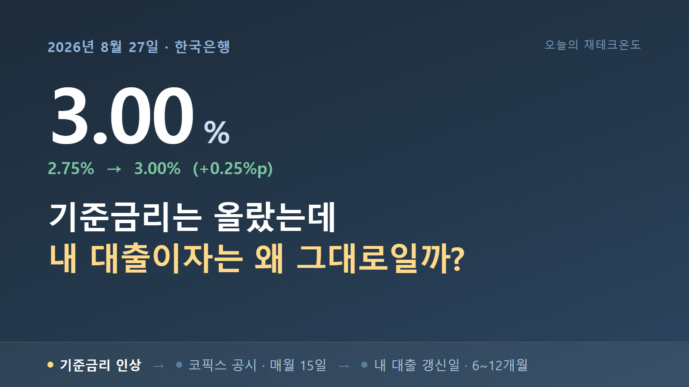
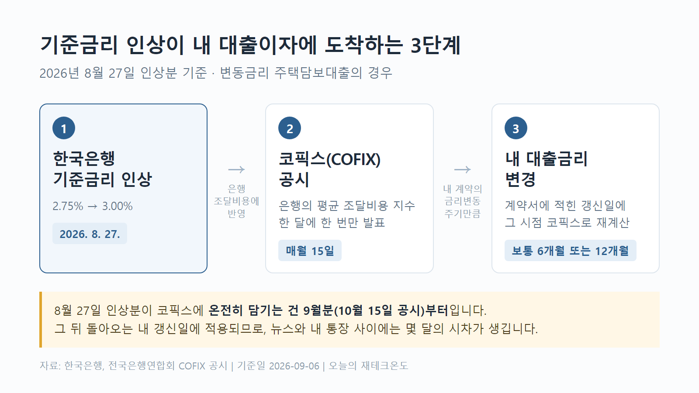
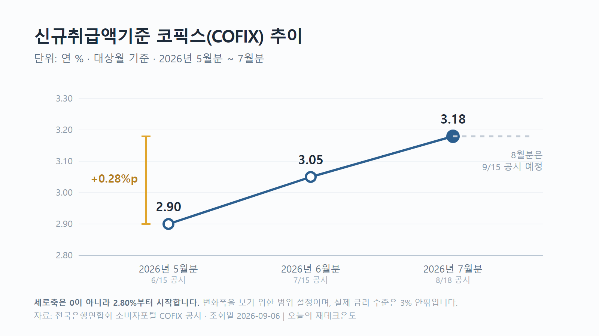
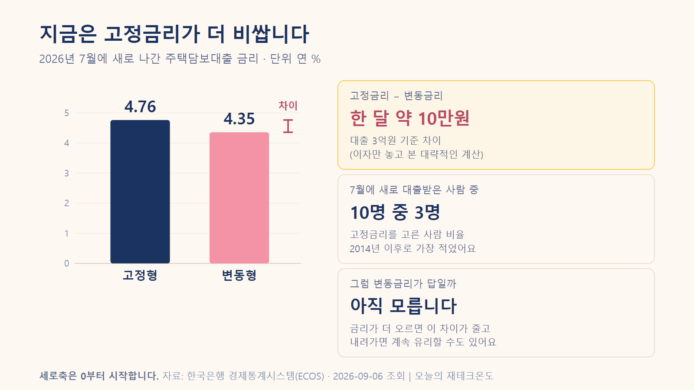

<!-- 이 파일은 md2html.js가 draft.md에서 자동으로 만듭니다. 직접 고치지 마세요. -->
<!-- 깃허브에서 이미지까지 같이 보기 위한 파일입니다. 발행본은 article-tistory.html 입니다. -->




# 기준금리 3% 됐는데, 내 대출이자는 왜 아직 그대로일까?

---

> [!NOTE]
> **읽기 전에 참고해주세요**
>
> 이 글의 금리·이자 계산은 이해를 돕기 위한 대략적인 계산입니다. 실제 금리는 개인의 대출 조건과 은행에 따라 달라질 수 있습니다.
>
> 특정 금융상품의 가입이나 갈아타기를 권유하는 글은 아닙니다.

8월 말에 기준금리가 올랐다는 뉴스를 봤습니다.

대출이 있으니 "이번 달부터 이자가 좀 늘겠구나" 했는데, 막상 확인해보니 그대로더라고요.

제가 뭔가 착각했나 싶어서 찾아봤습니다.

은행이 봐준 것도, 뉴스가 틀린 것도 아니었어요. 기준금리가 제 대출이자까지 오는 데 **시간이 걸리는 구조**였습니다.

그 구조를 알고 나니까 적어도 내 대출이자가 언제쯤 움직일지는 조금 감이 오더라고요.

---

## 일단 기준금리가 뭔지부터

저도 뉴스에서 자주 듣긴 했는데 정확히는 몰랐어요.

**기준금리는 한국은행이 정하는 "돈의 기본 값"입니다.**

은행끼리 돈을 빌리고 빌려줄 때 기준이 되는 금리예요. 이게 움직이면 우리가 내는 대출이자도, 받는 예금이자도 따라 움직입니다.

그 기준금리를 한국은행이 8월 27일에 연 2.75%에서 **3.00%**로 올렸습니다.

그런데 찾아보니 이게 처음이 아니었어요.

| 언제 | 기준금리 |
| --- | --- |
| 원래 | 2.50% |
| 7월 16일 | 2.75% |
| **8월 27일** | **3.00%** |

<sub>출처 · 한국은행 기준금리 · 2026년 8월 27일 적용 · [원문 보기](https://www.bok.or.kr/portal/main/main.do)</sub>

7월에 한 번 올리고, 8월에 또 올린 겁니다. **6주 사이에 두 번이에요.**

### 왜 두 번이나 올렸을까

찾아보니까 물가가 중요한 이유 중 하나였습니다.

한국은행이 8월에 낸 설명을 보면, 물가 오름세가 더 퍼지는 걸 미리 막을 필요가 있다는 이야기가 나옵니다.

금리를 정할 때는 물가 말고도 여러 가지를 같이 본다고 해요. 다만 이번에는 물가 이야기가 앞에 나왔습니다.

실제로 8월 물가는 1년 전보다 **3.1%** 올랐어요.

그런데 이 3.1%는 조금 걸러서 볼 필요가 있었습니다.

작년 8월에 한 통신사가 전체 가입자 요금을 절반 깎아줬거든요. 그래서 작년 통신비가 유난히 낮았습니다.

올해와 비교하니까 휴대전화료가 **26.7%** 오른 것으로 잡혔어요.

요금이 실제로 그만큼 오른 게 아니라, 비교 대상이던 작년 숫자가 낮았던 거죠.

물가가 오르는 중인 건 맞습니다. 다만 3.1%를 체감물가로 그대로 읽으면 조금 부풀려 보게 됩니다.

<sub>출처 · 국가데이터처 「2026년 8월 소비자물가동향」(2026-09-02) · [원문 보기](https://eiec.kdi.re.kr/policy/materialView.do?num=286216) · 상승률은 [한국은행 소비자물가지수](https://ecos.bok.or.kr) 원자료에서 직접 계산</sub>

---

## 그런데 왜 내 대출이자는 그대로일까

여기서부터 조금 헷갈렸습니다.

기준금리가 올랐는데 왜 내 대출금리는 바로 안 오르는 걸까요?

그 전에 하나만 짚고 갈게요. 대출금리에는 두 종류가 있습니다.

**고정금리**는 처음 정한 금리가 끝까지 그대로 가는 방식이에요. 3%로 빌렸으면 몇 년이 지나도 3%입니다.

**변동금리**는 정해진 날짜가 오면 금리를 다시 계산하는 방식이고요. 그때 금리가 올라 있으면 내 이자도 같이 오릅니다.

기준금리가 올라서 영향을 받는 건 **변동금리** 쪽이에요. 내 대출이 어느 쪽인지는 계약서에 적혀 있습니다.

아래 이야기는 변동금리 대출 기준으로 볼게요.

찾아보니까 은행도 돈을 그냥 갖고 있는 게 아니더라고요.

**은행도 돈을 어디선가 빌려옵니다.** 그 돈을 우리한테 다시 빌려주는 거예요.

그러니까 한국은행이 금리를 올리면, 은행이 돈 구해오는 비용부터 먼저 올라갑니다. 내 대출금리는 그다음이에요.

그림으로 보면 이렇습니다.



<sub>기준금리가 올라도 내 이자까지 오려면 두 번을 더 기다려야 합니다.</sub>

### 중간에 있는 그 숫자, 이름이 '코픽스'예요

은행이 돈 구해오는 데 얼마 썼는지 계산한 그 숫자를 **코픽스**라고 부릅니다.

은행 입장에서 보면 **원가표** 같은 거예요. 여기에 은행이 각자 남길 몫을 얹으면, 그게 우리한테 주는 금리가 됩니다.

대출 계약서나 은행 앱에서 이 단어를 보신 적이 있을 거예요. 그게 이겁니다.

그리고 이 숫자는 **한 달에 한 번, 매월 15일에만 나옵니다.**

### 사실 이미 오르고 있었어요

코픽스를 찾아보니 저도 좀 놀랐습니다. 넉 달째 오르는 중이었거든요.

4월에 2.89%였던 게 7월에는 3.18%가 됐습니다.



<sub>8월 인상과는 별개로, 코픽스는 이미 넉 달째 오르고 있었습니다.</sub>

3억원을 빌렸다면 이것만으로도 1년에 80만원 넘게 늘어난 셈이에요.

<sub>출처 · 전국은행연합회 COFIX 공시 · 2026년 4월분 2.89% → 7월분 3.18% · [공시 보기](https://portal.kfb.or.kr/fingoods/cofix.php)</sub>

은행들도 이미 금리를 올렸고요. 국민은행은 8월 19일부터 변동금리 주택담보대출 금리를 인상했습니다.

<sub>출처 · 한국경제 「코픽스 넉 달째 상승」(2026-08-18) · [기사 보기](https://www.hankyung.com/article/202608187767i)</sub>

그러니까 제 이자가 안 오른 게 아니라, **제 대출은 아직 순서가 안 온 거였습니다.**

### 그런데 8월 인상은 여기 없어요

그런데 위 그래프에서 가장 최근 숫자인 7월 기준 3.18%는 **8월 18일에 발표된 것**입니다.

기준금리가 오른 건 8월 27일이에요.

8월 27일에 기준금리가 올랐는데, 8월 18일에 발표된 코픽스에 이게 들어갈 수는 없겠죠. 아직 기준금리가 오르기도 전이었으니까요.

그래서 뉴스에서 "기준금리가 올랐다"는 소식을 봤다고 해서 내 대출금리도 그날 바로 움직이는 게 아니었습니다.

### 그럼 언제쯤 들어갈까

| 발표일 | 어느 달 기준 | 그 달에 인상이 적용됐던 기간 |
| --- | --- | --- |
| 8월 18일 | 7월 | 없음 (인상 전이라) |
| **9월 15일** | 8월 | **닷새뿐** (8월 27~31일) |
| **10월 15일** | 9월 | **한 달 전체** |

<sub>출처 · 전국은행연합회 COFIX 공시일자 · [일정 보기](https://portal.kfb.or.kr/compare/cofix_date.php)</sub>

9월 15일에 8월 기준 코픽스가 나옵니다. 그런데 인상은 8월 27일이었어요. 8월 한 달 중 닷새만 오른 상태였던 거죠.

**8월 인상이 한 달 내내 적용된 상태로 반영될 수 있는 건 9월 기준 코픽스입니다.** 그 숫자가 10월 15일에 발표되는 거고요.

다만 코픽스가 기준금리를 그대로 따라가는 건 아닙니다. 은행이 실제로 돈을 구해온 비용이라서 더 오를 수도, 덜 오를 수도 있어요.

### 그런데 아직 한 번 더 기다려야 해요

10월에 그 숫자가 올라도, 제 대출금리가 그날 바로 바뀌는 건 아닙니다.

대출마다 **금리가 바뀌는 날이 정해져 있거든요.** 보통 6개월이나 12개월에 한 번씩 돌아옵니다.

제 대출이 11월에 바뀌는 조건이라면, 8월 인상은 11월에야 제 이자에 나타납니다.

그러니까 제 경우에는 11월까지 기다려야 한다는 얘기였어요.

---

## 그럼 실제로 얼마나 오르는 걸까

아직 안 왔다는 건 뒤집어 보면 오고 있다는 뜻이기도 합니다. 미리 알아두면 마음의 준비라도 되겠죠.

계산 자체는 곱하기 한 번이면 끝납니다.

```text
빌린 돈 × 오른 금리 = 1년에 더 내는 이자
```

이번에 오른 만큼(2.50% → 3.00%)이 대출금리에 그대로 전해진다고 치면 이렇게 됩니다.

| 빌린 돈 | 1년에 더 내는 이자 | 한 달로 나누면 |
| --- | --- | --- |
| 1억원 | 50만원 | 약 4만원 |
| **3억원** | **150만원** | **약 12만원** |
| 5억원 | 250만원 | 약 21만원 |

3억원을 빌렸다면 한 달에 12만원 정도가 더 나가는 셈이에요.

다만 이건 이자만 놓고 본 대략적인 계산입니다.

매달 원금까지 같이 갚는 방식이라면 빌린 돈이 조금씩 줄어들어서, 실제 나가는 돈은 이보다 적어져요.

기준금리가 오른 만큼 대출금리가 100% 그대로 따라간다는 보장도 없고요.

정확한 금액이라기보다 "대충 이 정도 규모구나" 감을 잡는 용도로 봐주시면 됩니다.

---

## 그럼 고정금리로 갈아타야 하나?

보통 "금리 오를 것 같으면 고정으로 바꿔라"고들 하죠. 저도 그렇게 생각했는데, 숫자를 보니 얘기가 단순하지 않았습니다.

한국은행 자료를 보면 7월에 새로 나간 주택담보대출 금리가 이렇습니다.

| 구분 | 금리 (2026년 7월) |
| --- | --- |
| **고정금리** | **4.76%** |
| **변동금리** | **4.35%** |



<sub>지금은 고정금리 쪽이 더 비쌉니다. 3억원 기준으로 한 달에 10만원쯤 차이예요.</sub>

<sub>출처 · 한국은행 「2026년 7월 금융기관 가중평균금리」 · [원문 보기](https://www.bok.or.kr/portal/singl/newsData/list.do?menuNo=201263) · 수치는 [한국은행 경제통계시스템](https://ecos.bok.or.kr) 원자료로 대조</sub>

고정금리가 더 비쌌어요.

3억원을 빌린다면 한 달에 10만원쯤 차이가 납니다. 당장 나가는 돈만 보면 변동금리가 훨씬 유리하죠.

### 그래서 다들 변동금리를 골랐어요

7월에 새로 대출받은 사람 중 고정금리를 고른 사람은 **10명 중 3명**뿐이었습니다.

2014년 이후로 가장 적었어요.

한국은행 연구에서도 같은 흐름이 나옵니다. 고정과 변동의 금리 차이가 벌어질수록 변동금리를 고르는 사람이 늘어난다는 분석이었어요.

<sub>출처 · 고정금리 비중 — [한국은행 경제통계시스템](https://ecos.bok.or.kr)(2026년 7월) / 연구 — 최영준, 「주택담보대출 차입자의 금리 선택 분석」 · [보고서 보기](https://www.bok.or.kr/portal/bbs/P0002455/view.do?menuNo=500535&nttId=10096001)</sub>

당장 싼 쪽을 고르는 건 자연스러운 선택이에요.

### 그럼 변동금리가 답일까요

여기서부터는 저도 결론을 못 내렸습니다.

| | 지금 | 앞으로 |
| --- | --- | --- |
| **변동금리** | 매달 10만원쯤 저렴 | 기준금리 오르면 따라 오름 |
| **고정금리** | 매달 10만원쯤 비쌈 | 기준금리 올라도 그대로 |

지금은 변동금리가 더 싸지만, 기준금리가 앞으로 더 오르면 이 차이가 줄어들 수 있습니다.

반대로 금리가 다시 내려간다면 변동금리가 계속 유리할 수도 있고요.

결국 지금 금리만 보고 고정·변동 중 하나를 고르기는 어렵습니다.

갈아탈 때는 대출을 미리 갚는 수수료도 듭니다. 대출이 얼마나 남았는지도 같이 봐야 하고요.

몇 년 안에 집을 팔거나 대출을 갚을 생각이라면 변동금리가 나을 수도 있습니다.

---

## 그럼 예금은 좀 나아졌을까?

기준금리가 오르면 대출만 영향을 받는 건 아닙니다. 예금금리도 같이 움직일 수 있어요.

실제로 7월 은행 예금금리는 **3.21%**였습니다. 조금 오르긴 했어요.

그런데 여기서 제가 궁금했던 게 하나 있었습니다.

**"3.21%면 실제로 내 통장에는 얼마가 들어오는 거지?"**

이자에는 세금이 붙습니다. 3.21%에서 세금을 떼면 손에 남는 건 **2.7%** 정도예요.

그런데 여기서 끝이 아니었습니다.

예금으로 받은 이자는 늘었는데, 물가도 같이 올랐으니까요.

| | 얼마 |
| --- | --- |
| 예금 이자 (세금 떼기 전) | 3.21% |
| 예금 이자 (세금 떼고 나면) | 약 2.7% |
| 그동안 오른 물가 | 3.1% |

<sub>출처 · 예금금리 — [한국은행 경제통계시스템](https://ecos.bok.or.kr)(2026년 7월) / 물가 — 국가데이터처(2026년 8월)</sub>

받는 이자보다 물가가 더 많이 오른 셈이었어요.

앞에서 본 통신요금 때문에 물가가 실제보다 높아 보이는 부분을 빼면, 차이는 이보다 작을 겁니다.

그래도 통장 숫자는 늘어나는데, 그 돈으로 살 수 있는 물건은 별로 안 늘어나는 상황인 거죠.

"금리 올랐으니 예금 이자 좀 붙겠네" 하기엔 아직 이른 것 같습니다.

### 앞으로 더 오를까요?

한국은행은 물가와 경기를 보면서 정하겠다고 했습니다. 더 올릴 가능성을 닫지는 않은 표현이에요.

다만 이건 "오른다"가 아니라 **아직 안 정해졌다**는 뜻입니다. 다음 결정은 10월 22일이고요.

<sub>출처 · 한국은행 금융통화위원회 2026년 일정 · [일정 보기](https://www.bok.or.kr/portal/singl/crncyPolicyDrcMtg/listYear.do?menuNo=200755&mtgSe=A)</sub>

---

## 그럼 내 대출은 언제부터 달라질까?

여기까지 왔으면 이제 남은 건 어렵지 않습니다.

내 대출이 고정금리인지 변동금리인지, 변동금리라면 금리가 몇 개월마다 바뀌는지, 그리고 다음에 바뀌는 날이 언제인지만 보면 됩니다.

예를 들어 제 대출이 6개월마다 바뀌고, 다음 변경일이 11월 20일이라고 해볼게요.

```text
8월 27일   기준금리 인상
    ↓
10월 15일  9월 기준 코픽스 발표
    ↓
11월 20일  내 대출금리 변경   ← 이때부터 이자가 오릅니다
```

그래서 지금 제 통장에 아무 변화가 없었던 겁니다. 아직 11월이 안 왔으니까요.

뉴스를 잘못 본 것도, 은행이 봐준 것도 아니었어요.

---

## 그래서 오늘 뭘 보면 될까?

**내 대출의 금리가 다음에 언제 바뀌는지 확인해보세요.**

은행 앱이나 대출 약정서에서 확인할 수 있습니다.

다음에 기준금리가 올랐다는 뉴스를 봤을 때

**"그래서 내 이자는 언제부터 바뀌는데?"**

이 질문에 답할 수 있으면 됩니다.

---
**참고한 자료**

한국은행 · 전국은행연합회 · 국가데이터처

2026년 9월 6일 기준
