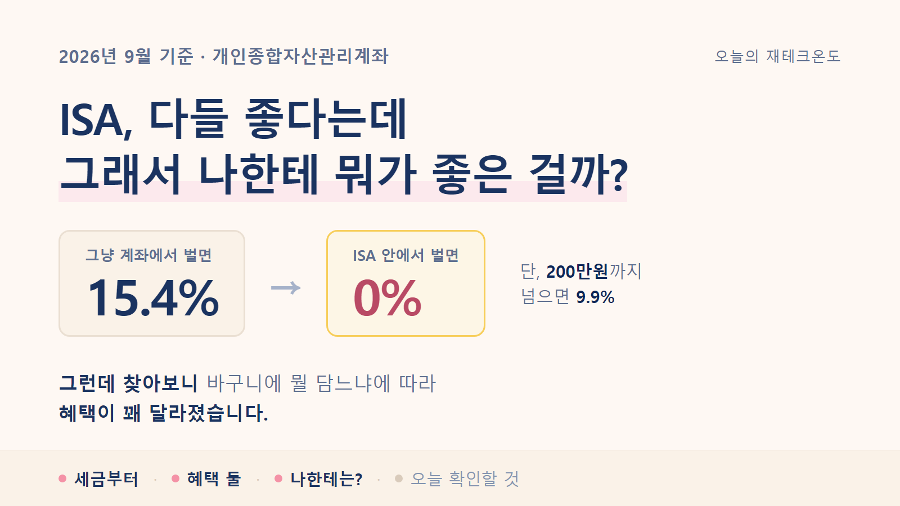
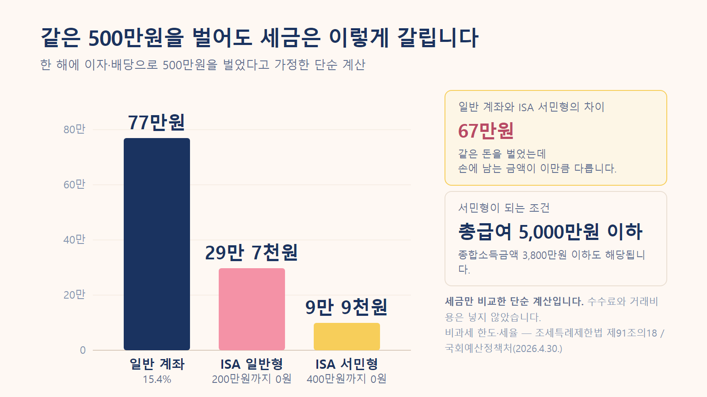
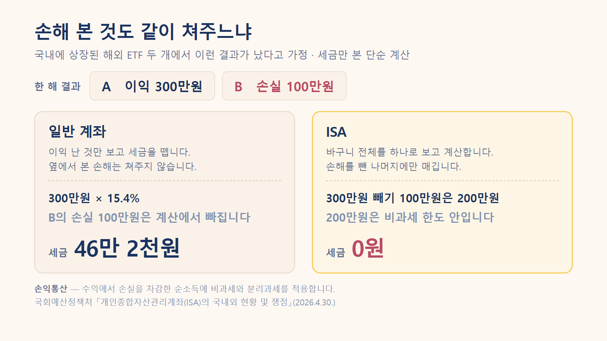
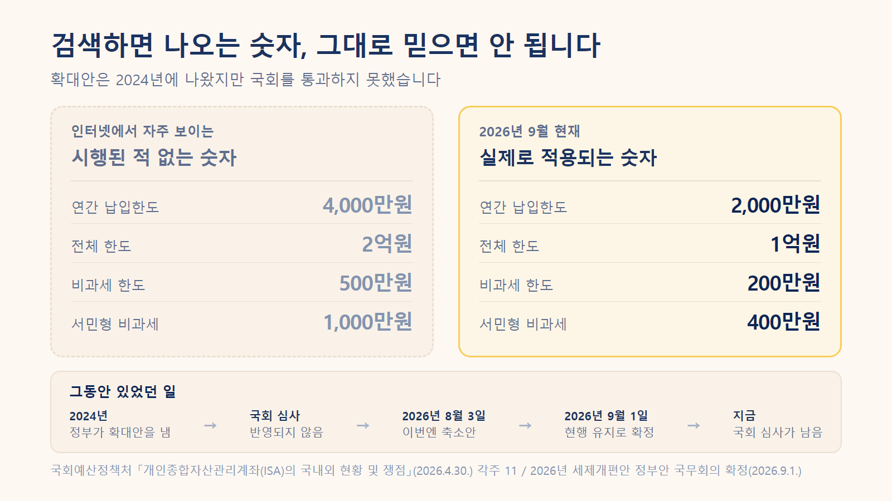

<!-- 이 파일은 md2html.js가 draft.md에서 자동으로 만듭니다. 직접 고치지 마세요. -->
<!-- 깃허브에서 이미지까지 같이 보기 위한 파일입니다. 발행본은 article-tistory.html 입니다. -->




# ISA, 다들 좋다는데 그래서 나한테 뭐가 좋은 걸까?

---

> [!NOTE]
> **읽기 전에 참고해주세요**
>
> 이 글의 세금 계산은 이해를 돕기 위한 대략적인 단순 계산입니다. 실제 세금은 소득과 투자 결과에 따라 달라질 수 있습니다.
>
> 특정 상품의 가입이나 해지를 권유하는 글은 아닙니다.

ISA 이야기를 참 오래 들었습니다.

통장 하나쯤 만들어두라고, 안 만들면 손해라고요.

그런데 누가 "그게 뭐가 좋은데?" 하고 물으면 저는 대답을 못 했습니다. 세금을 깎아준다는 것까지는 아는데, 뭘 얼마나 깎아주는지를 몰랐거든요.

그래서 한번 제대로 찾아봤습니다.

찾아보니 좋은 점도 분명했고, **저한테는 생각보다 덜 좋은 부분도 있었어요.**

---

## 그래서 ISA가 뭔데?

저는 한동안 ISA를 예금 같은 상품이라고 생각했습니다. 아니었어요.

ISA는 **상품이 아니라 계좌입니다.**

빈 바구니라고 보면 됩니다. 그 안에 예금도 넣고, 펀드도 넣고, ETF나 국내 주식도 넣을 수 있어요.

바구니 자체가 돈을 벌어주지는 않습니다. 안에 뭘 담느냐는 여전히 내가 정해야 해요.

대신 이 바구니에는 딱 하나 특별한 게 있습니다.

**바구니 안에서 번 돈에 붙는 세금을 깎아줍니다.**

정식 이름은 개인종합자산관리계좌입니다. 이름이 길어서 보통 ISA라고 부릅니다.

---

## 그런데 원래는 세금을 얼마나 내는데?

혜택이 얼마나 큰지 보려면 원래 얼마를 내는지부터 알아야 하더라고요. 저는 이 순서를 건너뛰어서 계속 감이 안 왔던 것 같습니다.

예금 이자나 주식 배당금처럼 **돈이 돈을 벌어다 준 소득**에는 세금이 붙습니다.

세율은 **15.4%**입니다.

100만원을 벌었으면 15만 4천원이 빠지고 84만 6천원이 들어옵니다. 내가 신고하는 게 아니라 받을 때 이미 떼고 들어와요. 그래서 세금을 낸다는 느낌도 잘 안 듭니다.

<sub>출처 · 이자·배당소득 원천징수세율 15.4%(소득세 14% + 지방소득세 1.4%) · 소득세법</sub>

이 15.4%가 앞으로 나올 이야기의 기준선입니다.

---

## 혜택 하나 — 200만원까지는 세금이 0원

ISA 안에서 번 돈은 **200만원까지 세금을 매기지 않습니다.**

여기서 제가 처음에 잘못 알아들었던 게 있어요.

**200만원을 넣는다는 뜻이 아닙니다. 200만원을 번다는 뜻입니다.**

원금이 아니라 수익 기준이에요. 2천만원을 넣어서 200만원을 벌었다면, 그 200만원에 세금이 안 붙습니다.

200만원을 넘으면요? 그때도 15.4%는 아닙니다. 넘은 부분에만 **9.9%**가 붙습니다.

그리고 이 한도는 소득에 따라 두 배가 됩니다.

| 구분 | 조건 | 세금 안 내는 금액 |
| --- | --- | --- |
| 일반형 | 아래에 해당하지 않는 경우 | **200만원** |
| 서민형 | 총급여 5,000만원 이하 | **400만원** |
| 농어민형 | 종합소득금액 3,800만원 이하인 농어민 | **400만원** |

<sub>출처 · 국회예산정책처 「개인종합자산관리계좌(ISA)의 국내외 현황 및 쟁점」(2026-04-30) · 조세특례제한법 제91조의18 · [원문 보기](https://www.nabo.go.kr/board/file/down.do?fid=33319223)</sub>

총급여 5,000만원이면 직장인 중에 해당하는 분이 꽤 많습니다. 저도 여기서 "어? 나 서민형이네" 했어요.

숫자로 보면 차이가 이렇게 납니다. 한 해에 500만원을 벌었다고 해볼게요.

| 어디에 담았나 | 세금 |
| --- | --- |
| 일반 계좌 | 77만원 |
| ISA 일반형 | 29만 7천원 |
| ISA 서민형 | 9만 9천원 |

계산은 이렇게 나왔습니다.

```text
일반 계좌   500만원 × 15.4%              = 770,000원

ISA 일반형  200만원 → 0원
            300만원 × 9.9%                = 297,000원

ISA 서민형  400만원 → 0원
            100만원 × 9.9%                =  99,000원
```

세금만 놓고 본 단순 계산입니다. 수수료나 거래비용은 넣지 않았어요.



<sub>같은 500만원을 벌어도 어디에 담았느냐로 세금이 갈립니다.</sub>

같은 500만원을 벌었는데 서민형이면 67만원이 남습니다. 한 달 통신비 몇 달치예요.

---

## 혜택 둘 — 손해 본 것도 같이 쳐준다

저는 이게 더 컸습니다.

일반 계좌는 **이익 난 것만 보고 세금을 뗍니다.** 옆에서 손해를 봤어도 안 봐줘요.

예를 들어 국내에 상장된 해외 ETF 두 개를 샀는데 결과가 이렇게 났다고 해볼게요.

```text
A       +300만원
B       −100만원

실제로 내 손에 남은 것: 200만원
```

일반 계좌라면 A에서 번 300만원에 세금이 붙습니다. B에서 잃은 100만원은 그냥 없는 셈 칩니다.

```text
300만원 × 15.4% = 462,000원
```

ISA는 다릅니다. **바구니 전체를 하나로 보고 계산합니다.**

```text
300만원 − 100만원 = 200만원
200만원은 비과세 한도 안 → 세금 0원
```

같은 투자를 했는데 46만 2천원이 갈립니다.



<sub>일반 계좌는 이익 난 것만 봅니다. ISA는 바구니 전체를 봅니다.</sub>

<sub>출처 · 손익통산 — 국회예산정책처 「ISA의 국내외 현황 및 쟁점」(2026-04-30) · [원문 보기](https://www.nabo.go.kr/board/file/down.do?fid=33319223)</sub>

투자를 하다 보면 전부 오르는 경우는 잘 없죠. 이것저것 담을수록 이 부분이 커집니다.

---

## 그런데 나한테도 해당되는 이야기일까?

여기서부터 제가 좀 김이 빠졌습니다.

찾다 보니 이런 내용이 나왔어요.

**국내 주식은 팔아서 남긴 차익에 원래 세금이 없습니다.**

대주주가 아닌 보통의 개인이 국내 상장주식을 사고팔아 남긴 돈에는 양도차익 세금이 붙지 않아요. ISA에 넣든 안 넣든 똑같이 0원입니다.

그러니까 **국내 개별주식만 사고파는 사람이라면 ISA로 아낄 수 있는 세금이 생각보다 적습니다.**

물론 아예 없는 건 아니에요. 두 가지가 남습니다.

- 그 주식이 주는 **배당금**에는 세금이 붙는데, 이건 ISA에서 깎입니다
- 주식에서 난 **손실**을 다른 상품의 이익과 통산해줍니다

반대로 ISA가 확실히 세게 작동하는 쪽도 있었습니다.

**국내에 상장된 해외 ETF입니다.**

이건 사고팔아서 남긴 차익도 배당소득으로 봅니다. 즉 팔 때마다 15.4%를 뗍니다. 게다가 다른 ETF에서 손해를 봐도 통산이 안 돼요.

앞에서 본 46만 2천원 차이가 바로 이 경우였습니다.

<sub>출처 · 국내 상장주식·펀드의 양도차익은 비과세(대주주 제외), 배당금은 배당소득으로 과세 / 국내 상장 해외펀드는 양도차익과 분배금 모두 배당소득으로 과세 — 국회예산정책처 「ISA의 국내외 현황 및 쟁점」 각주 9·10 · [원문 보기](https://www.nabo.go.kr/board/file/down.do?fid=33319223)</sub>

정리해보니 ISA가 도움이 되는 정도는 **내가 뭘 담느냐에 따라 꽤 달랐습니다.**

예금 이자, 배당금, 국내 상장 해외 ETF가 많을수록 커집니다. 국내 개별주식 매매 위주면 작아지고요.

---

## 그럼 대신 뭘 감수해야 하나

공짜는 아니겠죠. 조건을 봤습니다.

| 항목 | 내용 |
| --- | --- |
| 유지 기간 | **3년** |
| 연간 넣을 수 있는 돈 | 2,000만원 (못 채우면 다음 해로 이월) |
| 전체 한도 | 1억원 |
| 계좌 수 | 1인 1계좌 |
| 가입 나이 | 19세 이상 (15세 이상은 근로소득이 있으면 가능) |

<sub>출처 · 국회예산정책처 「ISA의 국내외 현황 및 쟁점」(2026-04-30) [표 1] · [원문 보기](https://www.nabo.go.kr/board/file/down.do?fid=33319223)</sub>

3년이 제일 걸렸습니다. 목돈이 3년간 잠기는 건가 싶었어요.

그런데 찾아보니 **넣은 원금은 중간에 뺄 수 있었습니다.**

3년을 채워야 하는 건 세금 혜택을 받기 위한 조건이에요. 계좌를 3년간 유지해야 비과세가 확정됩니다. 원금은 그 안에서도 인출이 됩니다. 다만 **번 돈은 못 빼요.** 그건 만기까지 둬야 합니다.

연 2,000만원 한도도 처음엔 커 보였는데, 실제 통계를 보니 좀 다르게 느껴졌습니다.

**한 사람당 평균 가입금액이 710만원입니다.** 한도의 3분의 1 수준이에요.

<sub>출처 · 2026년 2월 말 기준 · 금융투자협회 ISA 다모아 자료를 국회예산정책처가 정리 · [원문 보기](https://www.nabo.go.kr/board/file/down.do?fid=33319223)</sub>

한도가 모자라서 못 넣는 사람보다, 한도를 다 못 채우는 사람이 훨씬 많다는 뜻입니다. 저도 그쪽이고요.

---

## 만기 때 그냥 찾으면 아까운 이유

이건 찾다가 알게 된 건데 잘 안 알려진 것 같아요.

3년이 지나 만기가 오면 보통 돈을 찾습니다. 그런데 그 돈을 **연금저축이나 IRP로 옮기면** 세금을 한 번 더 돌려받을 수 있습니다.

옮긴 금액의 **10%**만큼 연금계좌 세액공제 한도가 늘어납니다. 최대 300만원까지요.

조건이 하나 있습니다. **만기일부터 60일 안에** 옮겨야 합니다.

3,000만원을 옮겼다고 해보면 이렇게 됩니다.

```text
3,000만원 × 10% = 300만원  (세액공제 한도가 이만큼 늘어남)

총급여 5,500만원 이하   300만원 × 16.5% = 495,000원
총급여 5,500만원 초과   300만원 × 13.2% = 396,000원
```

연말정산 때 40~50만원을 더 돌려받는 셈입니다.

<sub>출처 · 소득세법 시행령 제118조의2(계약기간 만료일부터 60일 이내 연금계좌 납입) · 연금계좌 세액공제율은 [국세청 안내](https://www.nts.go.kr/nts/cm/cntnts/cntntsView.do?cntntsId=7875)</sub>

다만 이건 그냥 좋은 게 아니라 **맞바꾸는 겁니다.**

연금계좌는 55세 이후에 연금으로 받는 걸 전제로 세금을 깎아주는 계좌예요. 그전에 찾으면 돌려받았던 세금을 다시 토해내야 합니다.

당장 쓸 돈이면 옮기지 않는 게 맞습니다.

---

## 인터넷에 도는 「4,000만원」 이야기

여기가 제일 헷갈렸던 부분입니다.

ISA를 검색하면 이런 글이 정말 많이 나옵니다.

> 2026년부터 납입한도가 연 4,000만원으로 늘고, 비과세도 500만원으로 확대됩니다

저도 처음엔 그런 줄 알았어요. 그런데 국회예산정책처 보고서를 보다가 각주에서 이런 문장을 발견했습니다.

> 2024년 정부 세법개정안은 현행 ISA 납입한도 및 비과세한도 확대와 국내투자형 ISA를 신설하고 금융소득종합과세자의 가입을 허용하는 내용을 포함하였으나, 국회 심사 과정에서 수직적 형평성 저해 등의 우려가 제기되면서 **개정세법에 반영되지 않음**

<sub>출처 · 국회예산정책처 「ISA의 국내외 현황 및 쟁점」(2026-04-30) 각주 11 · [원문 보기](https://www.nabo.go.kr/board/file/down.do?fid=33319223)</sub>

그러니까 4,000만원, 500만원은 **2024년에 정부가 내놓았던 안**이었습니다. 국회를 통과하지 못했고, 시행된 적이 없습니다.

지금 검색에 뜨는 글 상당수가 그때 나온 개정안 숫자를 **이미 시행된 제도인 것처럼** 쓰고 있었어요.

| 인터넷에서 자주 보이는 숫자 | 실제로 지금 적용되는 숫자 |
| --- | --- |
| 연 4,000만원 / 총 2억원 | **연 2,000만원 / 총 1억원** |
| 비과세 500만원 (서민형 1,000만원) | **비과세 200만원 (서민형 400만원)** |

왼쪽 숫자를 보고 계획을 세우면 실제로는 절반에서 막힙니다.



<sub>왼쪽은 2024년에 나왔다가 국회를 통과하지 못한 숫자입니다.</sub>

올해도 움직임이 있긴 했습니다. 다만 방향이 반대였어요.

8월 3일에 나온 2026년 세제개편안에는 국내 투자 전용인 **생산적금융 ISA를 새로 만드는** 내용이 담겼습니다. 그러면서 기존 일반 ISA는 계약기간을 최대 5년으로 제한하고 한도 이월도 없애겠다는 내용이 함께 들어갔습니다.

기존 가입자들 사이에서 반발이 있었고요.

그리고 **9월 1일 국무회의에서 이 축소안이 빠졌습니다.** 계약기간 제한도, 이월 폐지도 하지 않는 것으로 정부안이 확정됐습니다.

<sub>출처 · 2026년 세제개편안 정부안 국무회의 확정(2026-09-01) · 파이낸셜뉴스 [기사 보기](https://www.fnnews.com/news/202609011424331145) / 당초 개편안(2026-08-03)은 헤럴드경제 [기사 보기](https://biz.heraldcorp.com/article/10829468)</sub>

다만 이것도 아직 **정부안**입니다. 국회 심사가 남아 있어요.

2024년에도 정부안이 국회에서 그대로 통과되지 않았습니다. 그래서 저는 확정된 이야기로 받아들이지 않기로 했습니다.

지금 계좌를 만든다면 기준은 **연 2,000만원, 비과세 200만원(서민형 400만원)**입니다.

---

## 그래서 나한테는 뭐가 좋은 걸까

찾아본 걸 제 기준으로 정리해보니 이렇게 갈렸습니다.

**효과가 크게 나는 쪽**

- 예금·적금 이자가 꾸준히 생기는 사람
- 배당을 주는 주식이나 ETF를 모아가는 사람
- 국내에 상장된 해외 ETF를 사고파는 사람
- 여러 상품에 나눠 담아서 이익과 손실이 섞이는 사람
- 총급여 5,000만원 이하라 서민형이 되는 사람

**지금 당장은 급하지 않은 쪽**

- 국내 개별주식만 사고파는 사람 (원래 양도차익 세금이 없어서)
- 3년 안에 꼭 써야 할 목돈인 사람
- 아직 투자로 생기는 수익 자체가 크지 않은 사람

마지막 줄이 좀 허무하게 들릴 수도 있는데, 저한테는 이게 제일 정직한 답이었습니다.

ISA는 **번 돈에 붙는 세금을 깎아주는 장치**입니다. 벌어들이는 게 아직 적으면 깎일 것도 적어요.

그렇다고 의미가 없는 건 아닙니다. 계좌를 만들어두면 3년 시계가 그날부터 돌아가니까요. 나중에 수익이 커졌을 때 3년을 새로 기다리지 않아도 됩니다.

---

## 그래서 오늘 뭘 보면 될까?

딱 하나만 확인해보면 좋겠습니다.

**작년 총급여가 5,000만원 이하인지.**

이 한 줄로 세금 안 내는 금액이 200만원과 400만원으로 갈립니다. 앞에서 봤듯이 같은 500만원을 벌어도 세금이 29만 7천원과 9만 9천원으로 달라져요. 조건을 채우는데 몰라서 일반형으로 만드는 게 제일 아깝습니다.

숫자는 회사에서 받은 원천징수영수증이나 홈택스 지급명세서에 적혀 있습니다. 연말정산 서류를 그대로 두셨다면 거기 있어요.

다음에 ISA 이야기가 또 나오면 이 질문에 답할 수 있으면 됩니다.

**나는 지금 어떤 소득에 세금을 내고 있고, 그중 어떤 게 이 바구니 안에서 깎이는가.**

---
**참고한 자료**

국회예산정책처 · 국세청 · 법제처 국가법령정보센터 · 금융투자협회 · 재정경제부
2026년 9월 7일 기준
